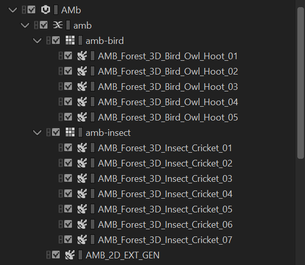
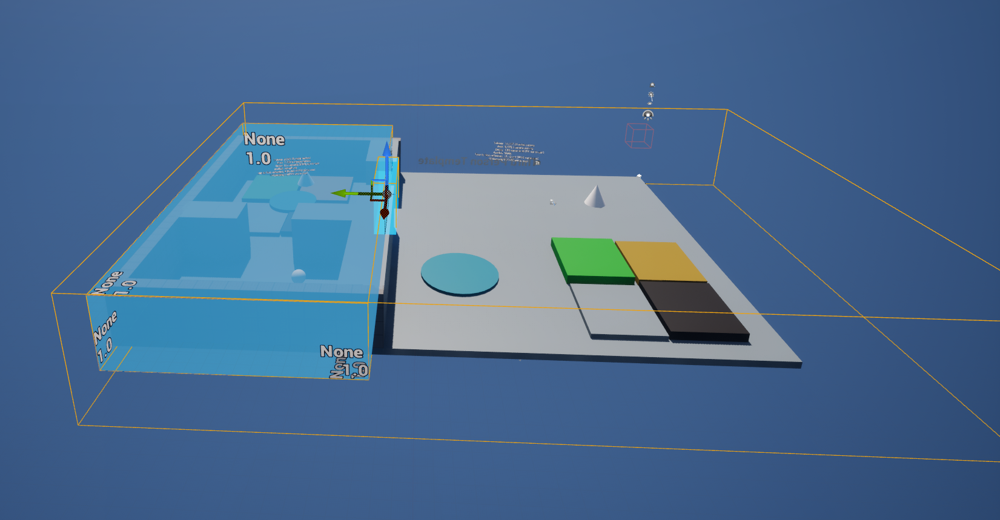
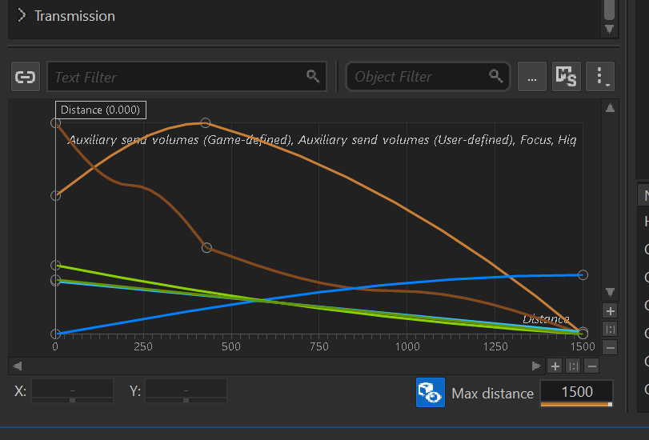
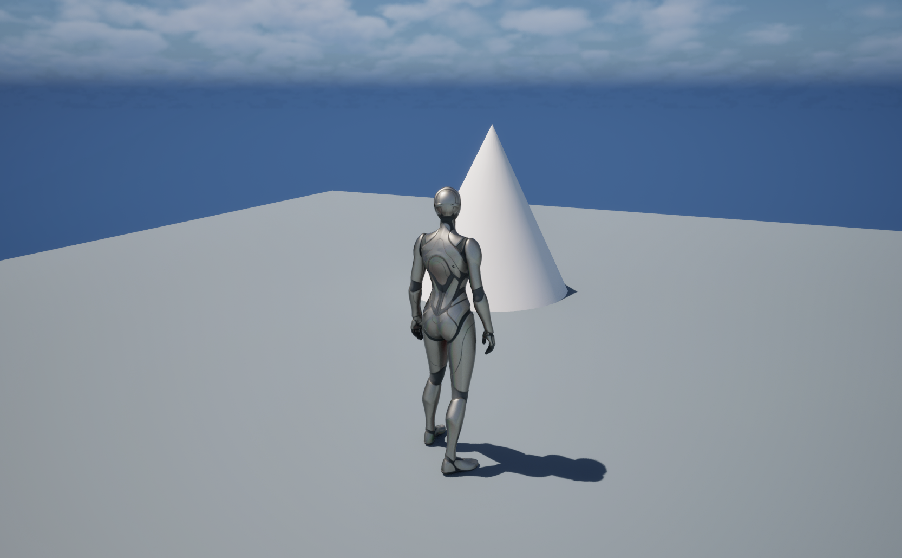
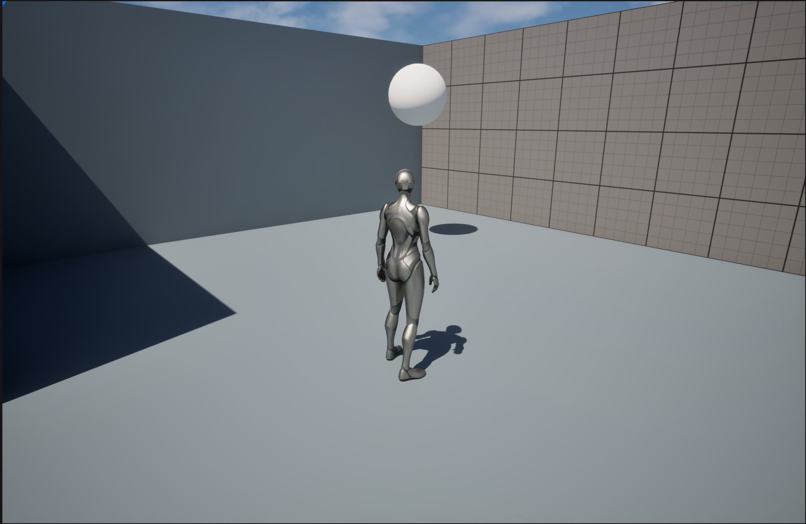
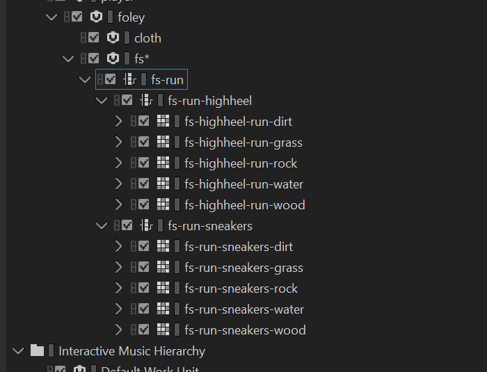
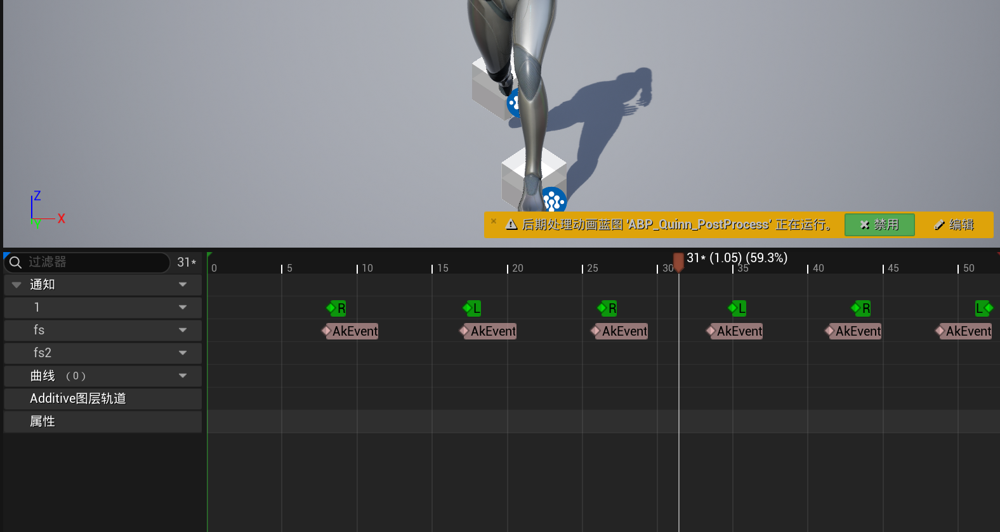
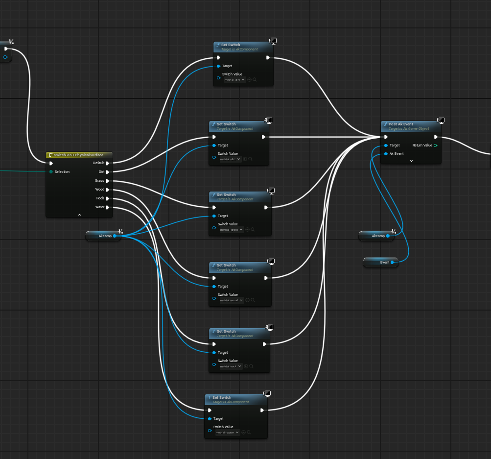
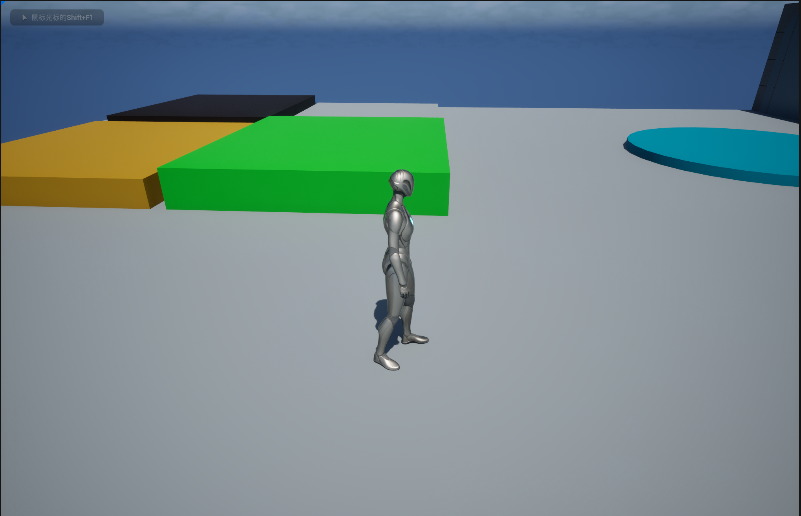
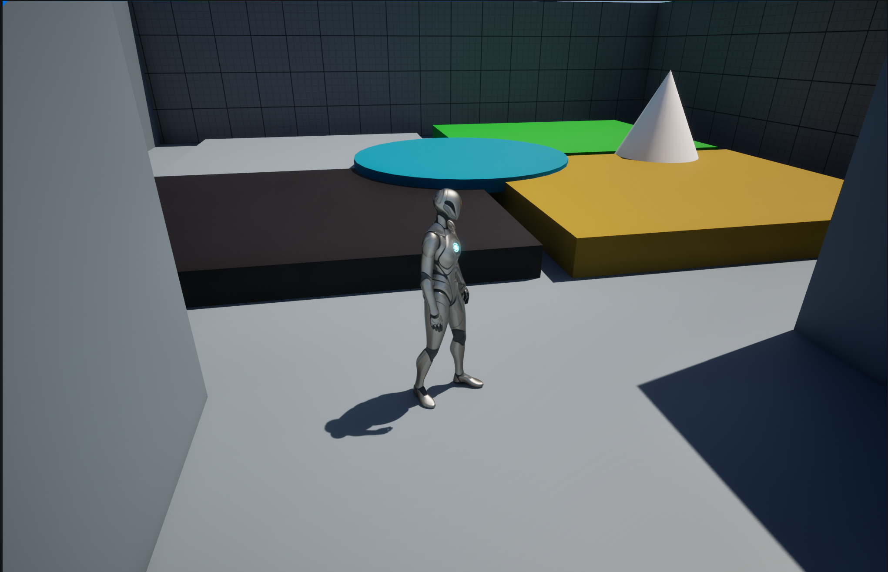

# 期末作业创作说明
23121996 林小茹
## 部分一：环境声的设计
#### 场景中的背景音在WWise中主要由铺底噪声和随机鸟叫和虫鸣组成，制作方式是分别先将鸟叫和虫鸣放入随机盒子中，增加一定的时间间隔循环播放，再将底噪循环，最后将三者合成。

#### 在UE中划分出不同声场来区分室内室外，并用Portal在交界处连接，将背景音放入包裹整个场景的大声场中，这样人物进入室内时会有明显的背景声变化。

## 部分二：场景中的物品声音及混响
#### 首先是篝火燃烧的声音，在wwise中将燃烧的空气声循环，将效果音随机循环，并控制各声音的音量大小，在position中分别控制各种衰减曲线。

#### 其次是播报音，在wwise中将其循环并调配随距离的衰减曲线。此时再用audio bus给场景加入混响效果，将两个物品的声音混响都打开。

#### 导入UE后创建蓝图用于播放物品声，这里分别绑定了圆锥体和球体。即可实现两种声音在不同空间中的不同效果。

## 部分三：脚步声
#### 脚步声按鞋子类型分为sneakers和highheels，按地面材质类型分为dirt、rock、grass、wood、water。首先在wwise中进行switch分组，将不同的类型的素材按照鞋子和地面素材分别加入随机盒子，形成独立的脚步声。最后打开混响效果。

#### 将素材同步到UE后，在run动画中加入每一步的脚步声，加好后再对脚步声进一步处理，通过蓝图完成脚步的射线识别，分别对应五种材质的连线。

## 部分四：整体布局
#### 整体分为室内和室外，室外有四种地块材质分别为dirt、grass、rock、wood，此外还增添了一块地模拟水池，以及一簇篝火模拟在室外的效果。

#### 室内也分为两个部分，一部分是地块和篝火的混响效果，一部分是广播人声的混响效果。可以听到人生有明显的回音。

演示视频https://pan.baidu.com/s/1TV0xvBeyD6ecvwhjxjw4_Q?pwd=dx5q

